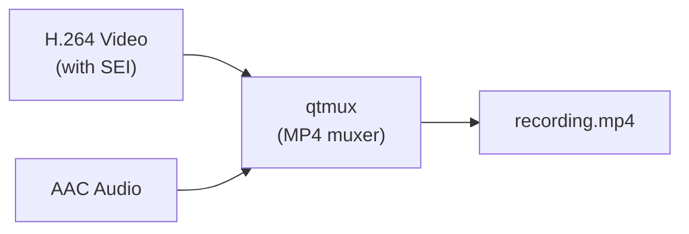
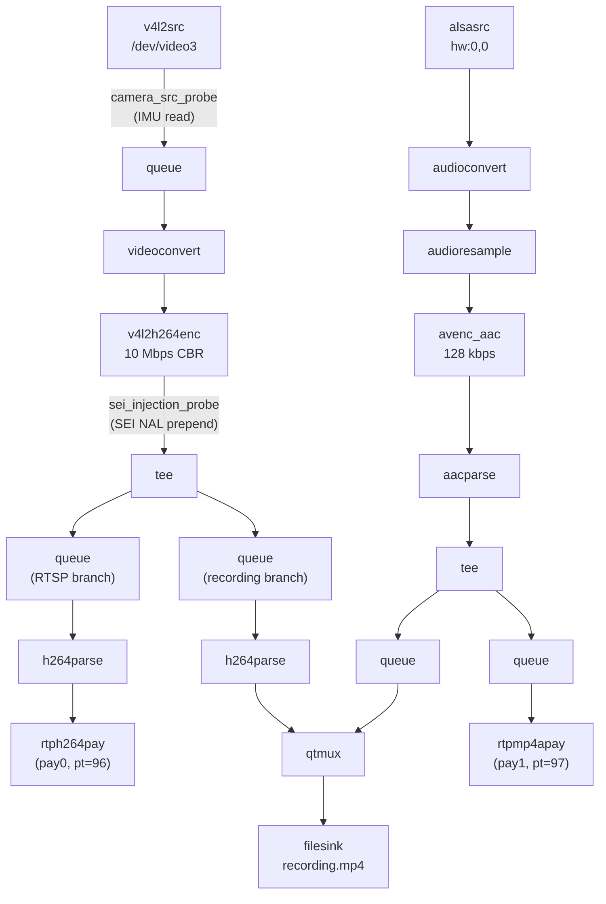

# GStreamer Audio Streaming & Recording Guide

## How Audio Works in GStreamer (from scratch)

### The Audio Pipeline — Conceptually Identical to Video

Just like video has `v4l2src → encode → mux/pay`, audio follows the exact same pattern:

```
capture → convert → encode → mux/pay
```

| Stage | Video | Audio |
|-------|-------|-------|
| **Capture** | `v4l2src` (camera via V4L2) | `alsasrc` (microphone via ALSA) |
| **Format Convert** | `videoconvert` (pixel format) | `audioconvert` + `audioresample` (sample format + rate) |
| **Encode** | `v4l2h264enc` (H.264 hardware) | `avenc_aac` or `opusenc` (AAC or Opus software) |
| **Mux/Stream** | `rtph264pay` → RTSP | `rtpmp4apay` → RTSP |
| **Record** | `h264parse` → `qtmux` → `filesink` | `aacparse` → `qtmux` → `filesink` |

---

## Step 1: Audio Capture — `alsasrc`

The Linux audio subsystem is **ALSA** (Advanced Linux Sound Architecture). `alsasrc` is GStreamer's ALSA source element — it reads PCM samples from a microphone.

```bash
# List available audio capture devices on the board:
arecord -l

# Typical output:
# card 0: imxaudiomicfil [imx-audio-micfil], device 0: micfil hifi...
# card 1: imxaudioxcvr [imx-audio-xcvr], device 0: ...
```

The raw output of `alsasrc` is **uncompressed PCM audio**:
- Format: S16LE (signed 16-bit little-endian) or S32LE
- Sample rate: 44100 Hz or 48000 Hz
- Channels: 1 (mono) or 2 (stereo)

```bash
# Test: record 5 seconds of audio to a WAV file
gst-launch-1.0 alsasrc device=hw:0,0 num-buffers=250 ! \
    audio/x-raw,rate=48000,channels=1,format=S16LE ! \
    wavenc ! filesink location=/tmp/test.wav
```

### Key Properties

| Property | Description |
|----------|-------------|
| `device=hw:0,0` | ALSA device: card 0, subdevice 0 |
| `do-timestamp=true` | Attach CLOCK_MONOTONIC timestamps (default for live sources) |
| `buffer-time=20000` | Internal buffer size in microseconds (20ms = low latency) |

---

## Step 2: Audio Format Conversion

Raw PCM from the mic may not match what the encoder expects. Two elements handle this:

```
alsasrc → audioconvert → audioresample → encoder
```

- **`audioconvert`**: Converts between sample formats (S16LE ↔ S32LE ↔ F32LE)
- **`audioresample`**: Changes sample rate (44100 → 48000, etc.)

Both are zero-copy when no conversion is needed.

---

## Step 3: Audio Encoding

### Option A: AAC (most compatible — works in MP4, RTSP, browsers)

```
audioconvert ! audioresample ! avenc_aac bitrate=128000 ! aacparse
```

| Property | Value | Notes |
|----------|-------|-------|
| `bitrate` | 128000 | 128 kbps — good quality for speech/ambient |
| Output | `audio/mpeg, mpegversion=4` | AAC-LC in raw ADTS frames |

AAC is the standard for MP4 containers and widely supported.

### Option B: Opus (better quality, lower latency — for WebRTC/streaming)

```
audioconvert ! audioresample ! opusenc bitrate=128000 ! opusparse
```

Opus is better for real-time streaming but less compatible with MP4 containers.

> [!TIP]
> For your use case (RTSP + MP4 recording), **AAC is the right choice**. It's natively supported by `qtmux` and all video players.

---

## Step 4: Muxing — Combining Video + Audio into One Container

### What is Muxing?

A **muxer** interleaves video and audio streams into a single container file. Think of it as a zipper that alternates between video frames and audio samples, keeping them time-synchronized.



### `qtmux` — The MP4/MOV Muxer

`qtmux` creates ISO MPEG-4 (.mp4) or QuickTime (.mov) files. It accepts:
- **Video**: H.264, H.265/HEVC, MJPEG
- **Audio**: AAC, MP3, Opus (in some builds)

```bash
# Minimal video+audio recording pipeline:
gst-launch-1.0 \
    v4l2src device=/dev/video3 ! videoconvert ! \
    video/x-raw,width=1920,height=1080,framerate=30/1 ! \
    v4l2h264enc extra-controls="controls,video_bitrate=10000000" ! \
    h264parse ! queue ! mux. \
    \
    alsasrc device=hw:0,0 ! audioconvert ! audioresample ! \
    audio/x-raw,rate=48000,channels=1 ! \
    avenc_aac bitrate=128000 ! aacparse ! queue ! mux. \
    \
    qtmux name=mux ! filesink location=/tmp/recording.mp4
```

### How `qtmux` Handles SEI Metadata

> [!IMPORTANT]
> **SEI NAL units survive MP4 muxing intact.** `qtmux` treats each H.264 access unit as an opaque byte sequence. It doesn't parse or strip supplemental NALs. Your IMU metadata embedded as SEI type 5 (user_data_unregistered) will be written into the MP4 file as part of each video sample.

When you later read the MP4 with `qtdemux ! h264parse`, the SEI NALs reappear in the byte stream exactly as they were injected.

---

## Step 5: RTSP Streaming with Audio

### Single-Stream RTSP (video only — current setup)

```
v4l2src → encoder → h264parse → rtph264pay name=pay0 pt=96
```

### Multi-Stream RTSP (video + audio)

The RTSP server supports multiple `pay` elements. Each `payN` becomes a separate RTP stream within the same RTSP session:

```c
gst_rtsp_media_factory_set_launch(factory,
    "( v4l2src name=cam_src device=/dev/video3 do-timestamp=true ! "
    "queue max-size-buffers=2 leaky=downstream ! "
    "videoconvert ! video/x-raw,width=1920,height=1080,framerate=30/1 ! "
    "v4l2h264enc name=hw_enc extra-controls=\"controls,video_bitrate=10000000\" ! "
    "video/x-h264,profile=high ! h264parse ! rtph264pay name=pay0 pt=96 "
    
    "alsasrc device=hw:0,0 do-timestamp=true ! "
    "audioconvert ! audioresample ! audio/x-raw,rate=48000,channels=1 ! "
    "avenc_aac bitrate=128000 ! aacparse ! rtpmp4apay name=pay1 pt=97 )");
```

- `pay0` = video stream (H.264, payload type 96)
- `pay1` = audio stream (AAC, payload type 97)

The RTSP server automatically generates an SDP (Session Description Protocol) with both media descriptions. Any RTSP client (VLC, GStreamer, ffplay) will automatically receive both streams.

### Client Side

```bash
# VLC (easiest — handles multi-stream automatically):
vlc rtsp://10.0.0.1:8554/stream

# GStreamer client:
gst-launch-1.0 rtspsrc location=rtsp://10.0.0.1:8554/stream name=src \
    src. ! rtph264depay ! h264parse ! avdec_h264 ! videoconvert ! autovideosink \
    src. ! rtpmp4adepay ! aacparse ! avdec_aac ! audioconvert ! autoaudiosink
```

---

## Step 6: Combined Pipeline — Stream + Record + SEI

Here's the complete architecture for live RTSP streaming + simultaneous MP4 recording with audio and SEI metadata:



### Key Design Points

1. **`tee` element** splits the encoded video into two branches (RTSP + recording) without re-encoding
2. **Each branch needs its own `queue`** to create a thread boundary — prevents one branch from blocking the other
3. **`h264parse`** is needed in both branches because each downstream element needs its own caps negotiation
4. **SEI metadata is injected once** (before the tee) and automatically flows into both branches
5. **Audio `tee`** similarly splits into RTSP payloader and MP4 muxer

---

## Audio Hardware on i.MX8MP

The i.MX8MP has several audio interfaces:

| Interface | GStreamer Device | Typical Use |
|-----------|----------------|-------------|
| PDM Microphone (MICFIL) | `alsasrc device=hw:0,0` | Built-in digital mics |
| SAI (Serial Audio Interface) | `alsasrc device=hw:1,0` | External codec (I2S) |
| HDMI Audio (XCVR) | `alsasrc device=hw:2,0` | HDMI audio input |

Run `arecord -l` on your board to see which devices are available.

> [!NOTE]
> The exact card/device numbers depend on your device tree configuration. The CompuLab UCM-i.MX8M-Plus board may have different numbering than the NXP EVK.

---

## Quick Reference: Audio Encoding Comparison

| Codec | GStreamer Element | Bitrate | Latency | MP4 Compatible | Best For |
|-------|-----------------|---------|---------|----------------|----------|
| AAC-LC | `avenc_aac` | 64-256 kbps | ~20ms | ✅ Yes | Recording, RTSP |
| Opus | `opusenc` | 32-256 kbps | ~5ms | ⚠️ Limited | WebRTC, low-latency |
| MP3 | `lamemp3enc` | 128-320 kbps | ~50ms | ✅ Yes | Legacy compatibility |
| Raw PCM | (none) | 1536 kbps | 0ms | ✅ Yes | Uncompressed archival |
