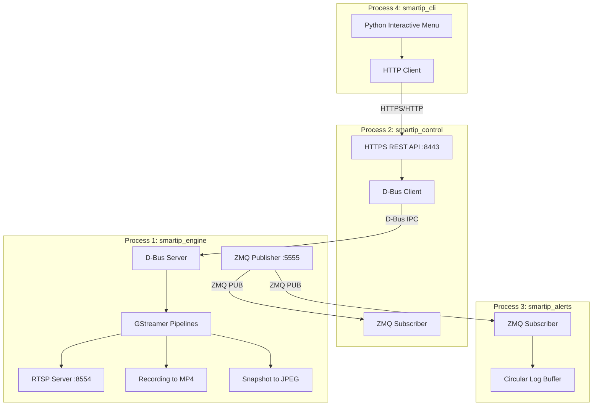
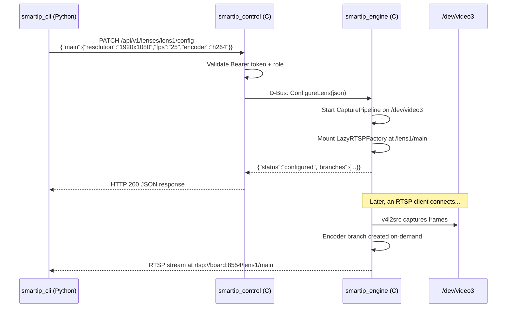
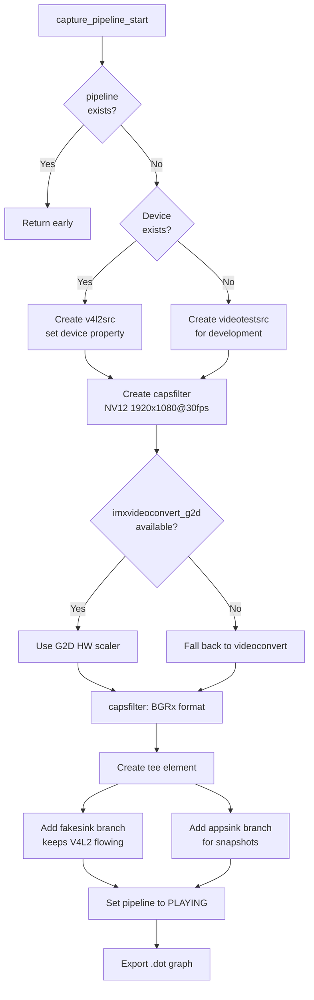
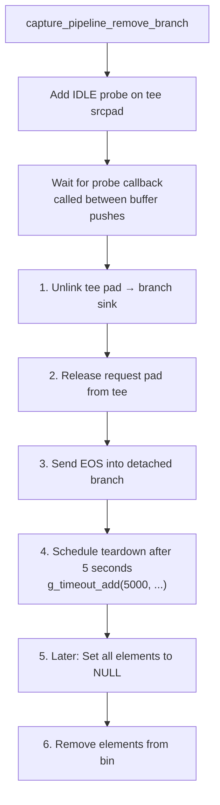
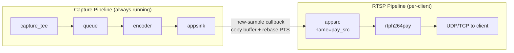
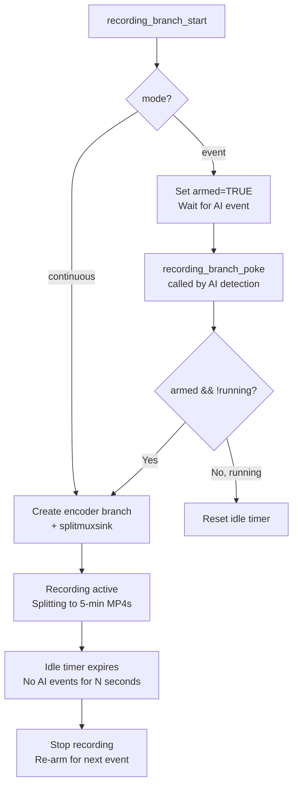
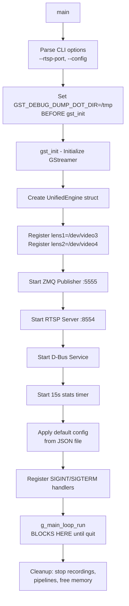
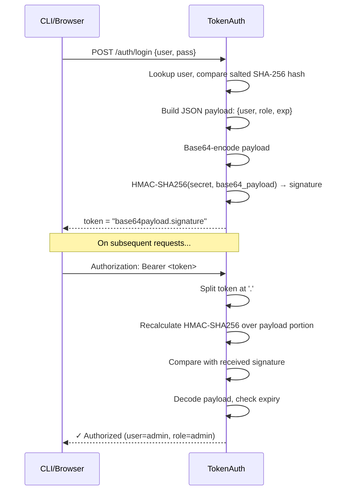

# SMART IP Edge Camera — Complete C Codebase Documentation

> **Purpose**: This document explains every single file, structure, function, variable, and macro in the C codebase. It is written for **learning**, not just reference. Each section explains *why* the code was written that way, what C/GLib/GStreamer concepts are at play, and how things flow end-to-end.

---

## Table of Contents

1. [System Architecture Overview](#1-system-architecture-overview)
2. [C Language Fundamentals Used in This Project](#2-c-language-fundamentals-used-in-this-project)
3. [Layer 0: Common Foundation (`src/common/`)](#3-layer-0-common-foundation)
4. [Layer 1: Unified Engine (`src/engine/`)](#4-layer-1-unified-engine)
5. [Layer 2: Control Plane (`src/control_plane/`)](#5-layer-2-control-plane)
6. [Layer 3: Alert Manager (`src/alert_manager/`)](#6-layer-3-alert-manager)
7. [Build System (`meson.build`)](#7-build-system)

---

## 1. System Architecture Overview

The application runs as **4 separate Linux processes** that communicate via **D-Bus** (commands) and **ZeroMQ** (events):



### Why 4 Separate Processes?

| Decision | Reason |
|----------|--------|
| **Engine is isolated** | A crash in the HTTP server doesn't kill the camera pipeline |
| **D-Bus between engine↔control** | Standard Linux IPC; typed method calls with introspection |
| **ZMQ for events** | Fire-and-forget pub/sub; zero coupling between producer and consumers |
| **Python CLI** | Rapid iteration for the user-facing tool; no recompilation needed |

### Data Flow for a Typical Command



---

## 2. C Language Fundamentals Used in This Project

### 2.1 Header Guards (`#ifndef / #define / #endif`)

Every `.h` file starts with:
```c
#ifndef SMARTIP_CONFIG_H
#define SMARTIP_CONFIG_H
// ... content ...
#endif
```

**Why?** In C, if a header is `#include`'d by multiple files, the compiler would see duplicate definitions. The guard ensures the content is only processed once. The naming convention `SMARTIP_<FILE>_H` is project-unique to avoid collisions.

### 2.2 `typedef struct` — Creating Named Types

```c
typedef struct {
    char device[64];
    gboolean overlay_enabled;
} LensInfo;
```

In C, without `typedef`, you'd have to write `struct LensInfo` everywhere. The `typedef` lets us write just `LensInfo`. We use **fixed-size char arrays** (`char device[64]`) instead of `char*` pointers to avoid heap fragmentation on embedded systems.

### 2.3 `g_new0()` — GLib's Zeroed Allocation

```c
LensInfo *l1 = g_new0(LensInfo, 1);
```

This is GLib's version of `malloc(sizeof(LensInfo))` + `memset(0)`. The `0` suffix means all bytes are zero-initialized. This is critical because:
- Booleans default to `FALSE`
- Pointers default to `NULL`
- Integers default to `0`

Without zeroing, you'd get garbage values that cause undefined behavior.

### 2.4 `GHashTable` — GLib's Hash Map

```c
engine->lenses = g_hash_table_new_full(g_str_hash, g_str_equal, g_free, g_free);
```

C has no built-in dictionary/map. GLib provides `GHashTable`. The 4 arguments are:
1. **Hash function** (`g_str_hash`): converts a string key to an integer
2. **Equality function** (`g_str_equal`): compares two keys
3. **Key destructor** (`g_free`): called when a key is removed
4. **Value destructor** (`g_free`): called when a value is removed

This is how we get Python-dict-like functionality in C with automatic memory cleanup.

### 2.5 `static` Functions — File-Local Scope

```c
static void _on_bus_error(GstBus *bus, GstMessage *msg, gpointer data) { ... }
```

The `static` keyword on a function means it's **only visible within this .c file**. It's like a Python function with a leading underscore `_on_bus_error()`. We use it for internal callbacks that no other file should call. The naming convention `_prefix` reinforces this intent.

### 2.6 `(void)parameter` — Suppressing Unused Warnings

```c
static void _on_alert(const char *topic, const char *json, gpointer user_data)
{
    (void)user_data;
    ...
}
```

In C, if a function parameter is declared but not used, the compiler emits a warning with `-Wall`. Casting to `(void)` explicitly says "I know this is unused, that's intentional." This is important because our callback signatures are dictated by the GLib/GStreamer API — we can't change them.

### 2.7 `snprintf()` — Safe String Formatting

```c
char endpoint[64];
snprintf(endpoint, sizeof(endpoint), "tcp://127.0.0.1:%d", port);
```

We **never** use `sprintf()` in this project because it has no buffer overflow protection. `snprintf()` takes a `size` argument that guarantees we never write past the buffer. On embedded systems, a buffer overflow can crash the entire device.

### 2.8 Forward Declarations

```c
typedef struct _UnifiedEngine UnifiedEngine;
```

This tells the compiler "UnifiedEngine is a struct type, but I'll define its contents later." This solves circular dependency problems — `rtsp_server.h` needs to reference `UnifiedEngine`, but `engine/main.c` defines it. Without forward declarations, the compiler would error.

---

## 3. Layer 0: Common Foundation

### Directory: `src/common/`

This is the **shared library** compiled into every binary. It contains zero application logic — only **constants** and **communication infrastructure**.

---

### 3.1 [config.h](file:///home/admin1/SMART_IP_EDGE_APPLICATION/working/setup1/codebase_c/src/common/config.h) — The Project's "Address Book"

**What it is**: A header-only file (no `.c` counterpart for most of it) containing every constant that multiple processes need to agree on.

**Why a single shared header?** If the engine binds D-Bus to `"com.camera.UnifiedEngine"` but the control plane connects to `"com.camera.Engine"`, nothing works. A single header file ensures all processes use the exact same strings.

#### Macros (Constants)

```c
#define UNIFIED_BUS_NAME "com.camera.UnifiedEngine"
#define UNIFIED_BUS_PATH "/com/camera/UnifiedEngine"
```

- **`UNIFIED_BUS_NAME`**: The D-Bus "service name" — like a DNS name for the engine on the system bus. The control plane uses this exact string to find the engine.
- **`UNIFIED_BUS_PATH`**: The D-Bus object path — like a URL path within the service. D-Bus convention uses `/reversed/domain/style`.

```c
#define TOPIC_AI_COORDS  "events/ai_coordinates"
#define TOPIC_ALERTS     "events/alerts"
#define ZMQ_DEFAULT_PORT 5555
```

- **ZMQ Topics**: ZeroMQ uses "topic filtering" — subscribers only receive messages whose topic string matches a prefix. `"events/alerts"` means "all alert-type events."
- **Port 5555**: The standard ZMQ port. Both publisher (engine) and subscriber (control, alerts) must use the same port.

```c
#define DEFAULT_HTTP_PORT   8443
#define DEFAULT_RTSP_PORT   8554
#define DEFAULT_CONFIG_PATH "data/default_config.json"
```

- **8443**: The HTTPS port (standard alternate HTTPS port). Control plane listens here.
- **8554**: The standard RTSP port (like how 80 is for HTTP).
- **Config path**: Relative to the binary's working directory (usually `/usr/bin/` on the board).

#### D-Bus Introspection XML — The "API Contract"

```c
static const gchar UNIFIED_IFACE_XML[] =
    "<node>"
    "  <interface name='com.camera.UnifiedEngine'>"
    "    <method name='ConfigureLens'>"
    "      <arg direction='in'  name='params_json' type='s'/>"
    "      <arg direction='out' name='response'    type='s'/>"
    "    </method>"
    ...
    "  </interface>"
    "</node>";
```

**What is this?** D-Bus requires a formal XML description of every method, including its arguments and types. This is like a **Swagger/OpenAPI spec** but for D-Bus.

**Why `static const gchar`?**
- `static`: This variable is only visible in the file that includes this header (avoids duplicate symbol errors when multiple `.c` files include it)
- `const`: The string is immutable — the compiler can place it in read-only memory
- `gchar`: GLib's typedef for `char` — used for consistency with GLib APIs

**Type `'s'`**: In D-Bus type system, `s` = string, `b` = boolean, `i` = int32. All our methods pass JSON as strings (`s`) and return JSON strings.

**Why pass JSON as a string instead of structured D-Bus types?**
Flexibility. If we used D-Bus native types (structs, arrays), every change to the parameter format would require updating the D-Bus XML schema, recompiling both engine and control plane, and updating the introspection. With JSON-in-a-string, we can add new fields without breaking the D-Bus contract.

---

### 3.2 [event_broker.h](file:///home/admin1/SMART_IP_EDGE_APPLICATION/working/setup1/codebase_c/src/common/event_broker.h) — ZeroMQ Pub/Sub Interface

**What it is**: Defines two opaque types: `MQPublisher` (send events) and `MQSubscriber` (receive events), plus their lifecycle APIs.

#### MQPublisher Structure

```c
typedef struct {
    void *zmq_ctx;      /* ZeroMQ context (one per process) */
    void *zmq_socket;   /* The PUB socket */
    int   port;         /* Port number (5555) */
} MQPublisher;
```

**Why `void *` for ZMQ pointers?** ZeroMQ's C API uses opaque `void*` handles intentionally — you interact with them only through `zmq_*()` functions. The library hides its internal implementation. This is C's equivalent of encapsulation.

#### MQSubscriber Structure

```c
typedef struct {
    void       *zmq_ctx;
    void       *zmq_socket;
    int         port;
    GThread    *listener_thread;  /* Background thread for receiving */
    gboolean    running;          /* Flag to stop the thread */
    MQCallback  callback;         /* Function pointer for event handling */
    gpointer    callback_data;    /* User data passed to callback */
} MQSubscriber;
```

**Key fields:**
- **`GThread *listener_thread`**: ZMQ's `zmq_recv()` is blocking — it waits until a message arrives. We run it in a background thread so it doesn't block the main GLib event loop.
- **`gboolean running`**: A thread-safe flag. The main thread sets it to `FALSE`, and the background thread checks it each loop iteration to know when to exit.
- **`MQCallback callback`**: A **function pointer** — the C equivalent of passing a Python callback function. The subscriber calls this function whenever it receives a message.

#### Callback Type Definition

```c
typedef void (*MQCallback)(const char *topic, const char *json_payload, gpointer user_data);
```

**Reading this typedef**: `MQCallback` is a pointer to a function that takes 3 arguments (topic string, JSON string, user data pointer) and returns nothing (`void`). Any function matching this signature can be passed as a callback.

---

### 3.3 [event_broker.c](file:///home/admin1/SMART_IP_EDGE_APPLICATION/working/setup1/codebase_c/src/common/event_broker.c) — Implementation

#### Publisher: `mq_publisher_new()`

```c
MQPublisher *mq_publisher_new(int port)
{
    MQPublisher *pub = g_new0(MQPublisher, 1);
    pub->port = port;
    pub->zmq_ctx = zmq_ctx_new();
    pub->zmq_socket = zmq_socket(pub->zmq_ctx, ZMQ_PUB);

    char endpoint[64];
    snprintf(endpoint, sizeof(endpoint), "tcp://127.0.0.1:%d", port);
    int rc = zmq_bind(pub->zmq_socket, endpoint);
    ...
}
```

**Flow:**
1. Allocate zeroed memory for the publisher struct
2. Create a ZMQ context (required before creating any socket)
3. Create a `ZMQ_PUB` socket — this is the "broadcaster" side
4. **`zmq_bind()`** — The publisher BINDS to a port. This is important: in ZMQ, the PUB side binds (like a server), and SUB sides connect (like clients). This means the publisher must start first.

#### Publisher: `mq_publisher_publish()`

```c
void mq_publisher_publish(MQPublisher *pub, const char *topic, const char *json_payload)
{
    zmq_send(pub->zmq_socket, topic, strlen(topic), ZMQ_SNDMORE);
    zmq_send(pub->zmq_socket, json_payload, strlen(json_payload), 0);
}
```

**ZMQ Multipart Messages**: ZMQ supports sending multi-frame messages. The `ZMQ_SNDMORE` flag says "this is part 1, more frames coming." The second `zmq_send()` without the flag says "this is the last frame." Subscribers use topic filtering on the first frame to decide whether to receive the full message.

#### Subscriber: Background Listener Thread

```c
static gpointer _listener_thread_func(gpointer data)
{
    MQSubscriber *sub = (MQSubscriber *)data;
    char topic_buf[256];
    char msg_buf[8192];

    while (sub->running) {
        int topic_len = zmq_recv(sub->zmq_socket, topic_buf, sizeof(topic_buf) - 1, 0);
        if (topic_len < 0) {
            if (zmq_errno() == EAGAIN) continue;
            ...
        }
        topic_buf[topic_len] = '\0';
        ...
        if (sub->callback) {
            sub->callback(topic_buf, msg_buf, sub->callback_data);
        }
    }
    return NULL;
}
```

**Why `sizeof(topic_buf) - 1`?** We reserve 1 byte for the null terminator `'\0'`. C strings must be null-terminated; ZMQ messages are NOT null-terminated (they're binary buffers with a length). So after receiving, we manually add `topic_buf[topic_len] = '\0'`.

**Why `EAGAIN`?** We set a 1-second receive timeout (`ZMQ_RCVTIMEO`). When the timeout expires without receiving a message, `zmq_recv()` returns -1 with `errno == EAGAIN`. This is normal — it just means "no messages yet, try again." Without this timeout, we'd never be able to stop the thread (it would block forever on `zmq_recv`).

---

## 4. Layer 1: Unified Engine

### Directory: `src/engine/`

This is the **heart of the system** — 11 files, ~1200 lines of C. It manages the physical cameras, video encoding, RTSP streaming, recording, and exposes everything over D-Bus.

---

### 4.1 Engine Architecture Flowchart

```mermaid
graph LR
    subgraph "Per-Lens Capture Pipeline"
        V[v4l2src<br/>/dev/video3] -->|NV12| CF[capsfilter<br/>1920x1080@30fps]
        CF --> G2D[imxvideoconvert_g2d<br/>Hardware Scaler]
        G2D -->|BGRx| CAPS[capsfilter<br/>BGRx format]
        CAPS --> TEE[tee<br/>capture_tee]
        
        TEE -->|Always| DQ[queue] --> FS[fakesink<br/>sync=TRUE]
        TEE -->|Always| SQ[queue<br/>leaky=2] --> AS[appsink<br/>Snapshot]
        TEE -.->|On-demand| RB[RTSP Branch]
        TEE -.->|On-demand| RC[Recording Branch]
    end
    
    subgraph "Dynamic RTSP Branch (created on client connect)"
        RB --> Q1[queue] --> S1[G2D Scaler] --> RF1[capsfilter<br/>target resolution] --> VR[videorate] --> ENC[v4l2h264enc] --> P1[h264parse] --> SINK[appsink]
        SINK -->|bridge| ASRC[appsrc] --> PAY[rtph264pay]
    end
```

---

### 4.2 [capture_pipeline.h](file:///home/admin1/SMART_IP_EDGE_APPLICATION/working/setup1/codebase_c/src/engine/capture_pipeline.h) — Pipeline Data Structures

#### BranchConfig — Stream Quality Parameters

```c
typedef struct {
    char  resolution[16]; /* e.g. "1920x1080" */
    int   fps;
    char  codec[16];      /* "h264", "h265", "mjpeg" */
    int   w;              /* Parsed width from resolution */
    int   h;              /* Parsed height from resolution */
} BranchConfig;
```

**Why store both `resolution` (string) and `w`/`h` (ints)?** The string is human-readable for JSON responses and logging. The integers are needed by GStreamer caps APIs which take separate width/height values. Parsing `"1920x1080"` every time with `sscanf()` would be wasteful, so we parse once at creation.

#### DynamicBranch — A Detachable Processing Chain

```c
typedef struct {
    char             name[64];       /* e.g. "rtsp_lens1_main" */
    CapturePipeline *capture;        /* Back-pointer to parent pipeline */
    GstElement     **elements;       /* Array of GStreamer elements in this branch */
    int              num_elements;   /* How many elements in the array */
    GstPad          *teepad;         /* The tee's src pad this branch is linked to */
    gboolean         removing;       /* Guard flag to prevent double-removal */
} DynamicBranch;
```

**Why `GstElement **elements` (pointer to pointer)?** This is a dynamic array of GStreamer element pointers. In C, an array of pointers is represented as `Type**` — a pointer to the first `Type*`. We allocate it with `g_new(GstElement*, count)` and access elements with `elements[i]`.

**Why `removing` flag?** GStreamer pad probes can fire multiple times for the same event. Without this guard, we'd try to teardown the same branch twice, causing crashes from double-free or operating on NULL pointers.

#### CapturePipeline — One Physical Camera

```c
struct _CapturePipeline {
    char          device[64];         /* "/dev/video3" */
    char          caps_str[256];      /* Source caps string */
    GstElement   *pipeline;           /* The top-level GstPipeline */
    GstElement   *capture_tee;        /* The tee element for branching */
    GstElement   *snap_sink;          /* appsink for instant snapshot */
    GHashTable   *dynamic_branches;   /* name → DynamicBranch* */
};
```

**Why `struct _CapturePipeline` (with underscore)?** The `typedef struct _CapturePipeline CapturePipeline;` forward declaration in the header uses the tag name `_CapturePipeline`. The actual definition here uses the same tag. This is a common C pattern for **opaque types** — the header declares the typedef, and only the `.c` file knows the internal layout.

---

### 4.3 [capture_pipeline.c](file:///home/admin1/SMART_IP_EDGE_APPLICATION/working/setup1/codebase_c/src/engine/capture_pipeline.c) — Pipeline Construction & Dynamic Branching

This is the most complex file in the project. It builds the GStreamer pipeline from physical hardware and manages runtime branch attachment/detachment.

#### Pipeline Construction: `capture_pipeline_start()`



**Key design decisions explained:**

**1. Why `videotestsrc` fallback?**
```c
if (g_file_test(cap->device, G_FILE_TEST_EXISTS)) {
    src = gst_element_factory_make("v4l2src", "v4l2src");
} else {
    src = gst_element_factory_make("videotestsrc", "v4l2src");
}
```
During development on a laptop (no camera hardware), `videotestsrc` generates color bars. This lets us test the entire pipeline logic without physical hardware. The element is named `"v4l2src"` regardless so that downstream code doesn't need to care.

**2. Why a permanent `fakesink`?**
```c
GstElement *dummy_sink = gst_element_factory_make("fakesink", "dummy_sink");
g_object_set(dummy_sink, "sync", TRUE, NULL);
```
A `tee` element splits video to multiple branches. But if **no** branches are connected, the tee has nowhere to send data, and the entire pipeline stalls. The `fakesink` acts as a "drain" that's always connected, keeping the V4L2 buffer pool recycling. `sync=TRUE` ensures it consumes buffers at the real framerate (not as fast as possible), which prevents queue overflow.

**3. Why `appsink` for snapshots?**
```c
cap->snap_sink = gst_element_factory_make("appsink", "snap_sink");
g_object_set(cap->snap_sink,
             "emit-signals", FALSE,
             "drop", TRUE,
             "max-buffers", 1,
             "sync", FALSE, NULL);
```
`appsink` is GStreamer's way of handing video frames to application code (rather than rendering/saving them). Properties:
- `drop=TRUE`: If we're not actively grabbing frames, throw them away (don't queue up)
- `max-buffers=1`: Only keep the most recent frame
- `sync=FALSE`: Don't wait for clock — we want the latest frame instantly

**4. Why G2D hardware scaler at capture level?**
The i.MX8MP SoC has a GPU-accelerated 2D graphics engine (G2D). By placing a G2D scaler between the source and the tee, we convert NV12 (camera native) to BGRx (which the encoder and AI branches expect) using **zero-copy DMA transfers**. Without this, each downstream branch would need its own software `videoconvert`, wasting CPU on the same conversion multiple times.

#### Dynamic Branch Attach/Detach

This is the most subtle part of the codebase. GStreamer pipelines must not be modified while running unless you follow a precise protocol.

**Attaching a branch (safe steps):**
```c
static void dynamic_branch_attach(DynamicBranch *br)
{
    /* 1. Add elements to the pipeline bin */
    for (int i = 0; i < br->num_elements; i++)
        gst_bin_add(GST_BIN(cap->pipeline), br->elements[i]);

    /* 2. Link elements in chain (queue→scaler→encoder→...) */
    for (int i = 0; i < br->num_elements - 1; i++)
        gst_element_link(br->elements[i], br->elements[i + 1]);

    /* 3. Sync state — bring new elements to PLAYING */
    for (int i = 0; i < br->num_elements; i++)
        gst_element_sync_state_with_parent(br->elements[i]);

    /* 4. Request a new tee pad and link it to the branch's first element */
    br->teepad = gst_element_request_pad_simple(cap->capture_tee, "src_%u");
    GstPad *sinkpad = gst_element_get_static_pad(br->elements[0], "sink");
    gst_pad_link(br->teepad, sinkpad);
}
```

**Why this exact order?** This follows the GStreamer dynamic pipeline documentation. If you link before adding to bin, or don't sync state, the elements won't be in PLAYING state and will reject buffers.

**Detaching a branch (the IDLE probe pattern):**



**Why IDLE probes?** You cannot safely unlink pads while data is flowing through them — it would corrupt the buffer being processed. An `IDLE` probe fires during the brief moment between buffer pushes when no data is in transit on that pad. Inside the probe callback, we safely unlink.

**Why 5-second delay for teardown?** The recording branch uses `splitmuxsink`, which writes MP4 files. MP4 files need a `moov` atom at the end to be playable. When we send EOS (End-of-Stream), `splitmuxsink` starts finalizing the file. If we immediately tear down the elements, this finalization is interrupted and the file is corrupted. The 5-second delay gives the muxer time to write the moov atom.

---

### 4.4 [encoder_builder.h/c](file:///home/admin1/SMART_IP_EDGE_APPLICATION/working/setup1/codebase_c/src/engine/encoder_builder.h) — Encoder Chain Factory

**What it does**: Given a codec name (h264/h265/mjpeg), resolution, and FPS, builds a complete processing chain as an array of GStreamer elements.

#### Output Chain

```
[queue] → [G2D scaler] → [capsfilter: WxH BGRx] → [videorate] → [encoder] → [parser]
```

#### Hardware Encoder Discovery

```c
const char *h264_encoders[] = {"v4l2h264enc", "imxvpuh264enc", NULL};
for (int i = 0; h264_encoders[i]; i++) {
    if (gst_element_factory_find(h264_encoders[i])) {
        enc = gst_element_factory_make(h264_encoders[i], name);
        break;
    }
}
if (!enc) {
    enc = gst_element_factory_make("x264enc", name);  /* Software fallback */
}
```

**Why a fallback chain?** The i.MX8MP board has VPU hardware encoders (`v4l2h264enc`), but a development laptop doesn't. By trying hardware first and falling back to software, the same binary works on both targets. `gst_element_factory_find()` checks if a plugin is installed without creating an instance.

#### Queue Parameters

```c
g_object_set(q,
    "max-size-buffers", 0,      /* No buffer count limit */
    "max-size-bytes",   0,      /* No byte count limit */
    "max-size-time",    100ms,  /* 100ms time window */
    "leaky",            2,      /* 2 = downstream (drop oldest) */
    NULL);
```

**Why `leaky=2`?** If the encoder is slower than the camera (e.g., encoding takes longer than 33ms at 30fps), the queue will fill up. With `leaky=2`, the oldest buffer is dropped from the downstream end, ensuring the encoder always gets the latest frames. Without leaky mode, the pipeline would stall waiting for the queue to drain.

---

### 4.5 [rtsp_server.h/c](file:///home/admin1/SMART_IP_EDGE_APPLICATION/working/setup1/codebase_c/src/engine/rtsp_server.c) — Lazy RTSP Factory

**The "Lazy" Pattern**: Unlike traditional RTSP servers that always encode, our factory creates the encoder branch **only when the first client connects** and destroys it when the last client disconnects. This saves significant CPU/GPU resources when no one is watching.

#### LazyRTSPData — Per-Factory State

```c
typedef struct {
    UnifiedEngine   *engine;
    CapturePipeline *capture;
    char             lens[32];       /* "lens1" */
    char             tier[32];       /* "main" */
    BranchConfig    *config;         /* Resolution/fps/codec */
    char             mount_path[64]; /* "/lens1/main" */
    char             branch_name[64];/* "rtsp_lens1_main" */
    GstElement      *appsrc;        /* Bridge: destination in RTSP pipeline */
    GstElement      *appsink_ref;   /* Bridge: source from capture pipeline */
    guint64          base_pts;      /* PTS rebasing for RTSP timing */
    gboolean         base_pts_set;
    gulong           handler_id;
    int              frame_count;
    GMutex           branch_lock;   /* Thread safety for encoder creation */
} LazyRTSPData;
```

**Why `GQuark` for attaching data?**
```c
g_object_set_qdata_full(G_OBJECT(factory), _lazy_rtsp_quark(), d, g_free);
```
GLib's `qdata` system lets you attach arbitrary data to any GObject using a string-based key (quark). We attach our `LazyRTSPData` to the `GstRTSPMediaFactory` so that inside signal callbacks (where we only receive the factory pointer), we can retrieve all our state.

#### The appsink → appsrc Bridge



**Why a bridge instead of direct linking?** The capture pipeline and the RTSP pipeline are separate GstPipelines with separate clocks. You cannot link elements across pipelines. The bridge pattern:
1. `appsink` receives encoded frames from the capture pipeline
2. A callback function copies the buffer and pushes it into `appsrc`
3. `appsrc` feeds the RTSP payloader

**PTS Rebasing:**
```c
guint64 pts = GST_BUFFER_PTS(buf);
if (!d->base_pts_set) {
    d->base_pts = pts;
    d->base_pts_set = TRUE;
}
GstBuffer *new_buf = gst_buffer_copy(buf);
GST_BUFFER_PTS(new_buf) = pts - d->base_pts;
GST_BUFFER_DTS(new_buf) = GST_CLOCK_TIME_NONE;
```

The capture pipeline's PTS (Presentation Time Stamp) starts from when the pipeline was created (could be hours ago). But the RTSP client expects timestamps starting from 0. Rebasing subtracts the first frame's PTS from all subsequent frames.

---

### 4.6 [recording.h/c](file:///home/admin1/SMART_IP_EDGE_APPLICATION/working/setup1/codebase_c/src/engine/recording.c) — Video Recording to MP4

#### Two Recording Modes



- **Continuous mode**: Recording starts immediately and runs until explicitly stopped
- **Event mode**: Recording is "armed" but not started. When the AI engine detects a violation, it calls `recording_branch_poke()`, which starts the actual recording. If no further AI events arrive within `idle_timeout` seconds, recording stops and re-arms.

#### splitmuxsink Configuration

```c
g_object_set(mux,
    "location",        "/tmp/recordings/lens1/main/rec_lens1_main_1234_%05d.mp4",
    "max-size-time",   (guint64)(300 * GST_SECOND),  /* 5-minute segments */
    "async-finalize",  FALSE,
    NULL);
```

- **`location` with `%05d`**: `splitmuxsink` auto-increments the segment number (00001.mp4, 00002.mp4, etc.)
- **`max-size-time`**: Each file is at most 5 minutes. This prevents single huge files that are hard to manage.
- **`async-finalize=FALSE`**: Ensures the moov atom is written synchronously when a segment ends, preventing corruption.

---

### 4.7 [dbus_service.h/c](file:///home/admin1/SMART_IP_EDGE_APPLICATION/working/setup1/codebase_c/src/engine/dbus_service.c) — D-Bus Method Router

**What it does**: Receives D-Bus method calls and dispatches them to the engine functions. It's a pure routing layer with no business logic — a router/dispatcher pattern.

```c
static void _handle_method_call(..., const gchar *method_name, GVariant *parameters, ...)
{
    if (g_strcmp0(method_name, "ConfigureLens") == 0) {
        const gchar *json;
        g_variant_get(parameters, "(&s)", &json);
        result = engine_configure_lens(engine, json);
        g_dbus_method_invocation_return_value(invocation, g_variant_new("(s)", result));
    } else if (g_strcmp0(method_name, "UpdateStreamParams") == 0) {
        const gchar *lens, *branch, *json;
        g_variant_get(parameters, "(&s&s&s)", &lens, &branch, &json);
        result = engine_update_stream(engine, lens, branch, json);
        ...
    }
    ...
}
```

**`g_variant_get(parameters, "(&s)", &json)`** — GVariant is GLib's type system for D-Bus. The format string `"(&s)"` means "get a reference to a string from inside a tuple." The `&` means "borrow, don't copy" (no need to free `json`). The parentheses `()` represent the D-Bus method's argument tuple.

**`GDBusInterfaceVTable`** — This struct tells GLib: "When a D-Bus method call arrives, call this function." It has 3 slots: `method_call`, `get_property`, `set_property`. We only implement `method_call`.

---

### 4.8 [engine/main.c](file:///home/admin1/SMART_IP_EDGE_APPLICATION/working/setup1/codebase_c/src/engine/main.c) — The Engine Entry Point (~1030 lines)

This is the largest file. It contains the `UnifiedEngine` struct, all D-Bus method implementations, RTSP client tracking, system stats, config management, and the `main()` function.

#### UnifiedEngine — The Central State Object

```c
typedef struct _UnifiedEngine {
    GMainLoop       *loop;            /* GLib main event loop */
    GstRTSPServer   *rtsp_server;     /* RTSP server instance */
    MQPublisher     *mq_pub;          /* ZMQ event publisher */
    guint            dbus_owner_id;    /* D-Bus name ownership ID */
    GHashTable      *lenses;          /* "lens1" → LensInfo* */
    GHashTable      *captures;        /* "/dev/video3" → CapturePipeline* */
    GHashTable      *branch_configs;  /* "lens1/main" → BranchConfig* */
    GHashTable      *recordings;      /* "lens1/main" → RecordingBranch* */
    GHashTable      *active_branches; /* "/lens1/main" → client_count */
    GHashTable      *session_mounts;  /* session_id → mount_path */
    int              total_clients;
    int              rtsp_port;
    char             config_path[256];
    char             default_caps[256];
} UnifiedEngine;
```

**Why so many GHashTables?** Each table tracks a different relationship:
- `lenses`: Maps lens names to their physical device + config
- `captures`: Maps device paths to running pipelines (one pipeline per physical camera)
- `branch_configs`: Maps "lens/tier" keys to stream quality settings
- `recordings`: Maps "lens/tier" keys to active recording branches
- `active_branches`: RTSP client reference counting per mount point
- `session_mounts`: Maps RTSP session IDs to mount paths for cleanup on disconnect

#### main() — Engine Bootstrap



---

## 5. Layer 2: Control Plane

### Directory: `src/control_plane/`

The control plane acts as a **secure HTTP gateway** to the engine. It never touches GStreamer directly — all commands go through D-Bus.

---

### 5.1 [auth.h/c](file:///home/admin1/SMART_IP_EDGE_APPLICATION/working/setup1/codebase_c/src/control_plane/auth.c) — HMAC-SHA256 Token Authentication

#### Token Lifecycle Flow



#### Password Storage (Salted Hashing)

```c
void token_auth_add_user(TokenAuth *auth, const char *username, const char *password, const char *role)
{
    UserRecord *u = g_new0(UserRecord, 1);
    _random_hex(u->salt, 32);                              /* Generate random salt */
    _hash_password(u->salt, password, u->password_hash, sizeof(u->password_hash));
    g_hash_table_insert(auth->users, g_strdup(username), u);
}
```

**Why salt?** Without salt, two users with the same password would have the same hash, making rainbow table attacks possible. The random salt (unique per user) ensures every hash is different even for identical passwords.

**`_hash_password()` internals:**
```c
static void _hash_password(const char *salt, const char *password, char *out, int out_len)
{
    char salted[512];
    snprintf(salted, sizeof(salted), "%s%s", salt, password);  /* Concatenate salt+password */
    GChecksum *cs = g_checksum_new(G_CHECKSUM_SHA256);
    g_checksum_update(cs, (guchar *)salted, strlen(salted));
    g_strlcpy(out, g_checksum_get_string(cs), out_len);       /* Get hex digest string */
    g_checksum_free(cs);
}
```

Uses GLib's built-in SHA-256 — no external crypto library needed. The `(guchar *)` cast is required because `g_checksum_update()` takes unsigned bytes but our string is `char *` (signed on most platforms).

#### Role-Based Permission Check

```c
gboolean token_auth_check_perm(TokenAuth *auth, const char *role, const char *command)
{
    if (g_strcmp0(role, "admin") == 0) return TRUE;  /* Admin has all permissions */
    
    if (g_strcmp0(role, "operator") == 0) {
        /* Check operator-specific permissions */
        for (int i = 0; auth->operator_perms[i]; i++) {
            if (g_strcmp0(command, auth->operator_perms[i]) == 0) return TRUE;
        }
        /* Operator inherits viewer permissions */
        for (int i = 0; auth->viewer_perms[i]; i++) {
            if (g_strcmp0(command, auth->viewer_perms[i]) == 0) return TRUE;
        }
    }
    ...
}
```

**Permission hierarchy**: Admin > Operator > Viewer. Each role inherits all permissions of roles below it. The `NULL`-terminated arrays (`VIEWER_PERMS[]`, `OPERATOR_PERMS[]`) act as permission lists.

---

### 5.2 [http_server.h/c](file:///home/admin1/SMART_IP_EDGE_APPLICATION/working/setup1/codebase_c/src/control_plane/http_server.c) — HTTPS Server (libsoup)

**Pre-built library**: `libsoup` is GNOME's HTTP library (like Python's `http.server`). We use libsoup 2.4 which provides `SoupServer`, `SoupMessage`, etc.

#### TLS Certificate Auto-Generation

```c
if (!g_file_test(cert_path, G_FILE_TEST_EXISTS)) {
    char cmd[512];
    snprintf(cmd, sizeof(cmd),
        "openssl req -x509 -newkey rsa:2048 -keyout %s -out %s "
        "-days 365 -nodes -subj '/CN=demo-camera/O=IPCameraDemo/C=IN' "
        "2>/dev/null", key_path, cert_path);
    if (system(cmd) != 0) {
        g_warning("Failed to generate TLS cert — falling back to HTTP");
        srv->tls = FALSE;
    }
}
```

**Why `system()` for openssl?** OpenSSL's C API for certificate generation is extremely complex (~200 lines). A shell command does the same in one line. On the embedded board, `openssl` binary is available via the Yocto image. The `-nodes` flag means "no password on the private key" (required for automated server startup).

#### Role-Based Authorization Utility

```c
gboolean http_server_authorize(HTTPServer *srv, SoupMessage *msg, GHashTable *query, const char *required_role)
```

This utility extracts the Bearer token from either the `Authorization` header or a `?token=` query parameter (for browser SSE clients that can't set headers), validates it, and checks the role hierarchy. If it fails, it automatically sends the appropriate HTTP error (401 Unauthorized or 403 Forbidden).

---

### 5.3 [control_plane/main.c](file:///home/admin1/SMART_IP_EDGE_APPLICATION/working/setup1/codebase_c/src/control_plane/main.c) — REST Route Handlers

#### Route Architecture

| Route Pattern | Handler | HTTP Method | D-Bus Call |
|--------------|---------|-------------|-----------|
| `/api/v1/auth/login` | Built-in (http_server.c) | POST | — |
| `/api/v1/system/health` | Built-in (http_server.c) | GET | — |
| `/api/v1/system/status` | `_route_system()` | GET | `GetStatus` |
| `/api/v1/system/log_level` | `_route_system()` | PUT | `SetLogLevel` |
| `/api/v1/lenses/<id>/config` | `_route_lenses()` | PATCH | `ConfigureLens` |
| `/api/v1/lenses/<id>/recording` | `_route_lenses()` | POST/DELETE | `Start/StopRecording` |
| `/api/v1/lenses/<id>/snapshot` | `_route_lenses()` | POST | `TakeSnapshot` |
| `/api/v1/lenses/<id>/streams/<branch>/params` | `_route_lenses()` | PATCH | `UpdateStreamParams` |

#### Path Parsing in `_route_lenses()`

```c
gchar **parts = g_strsplit(path, "/", -1);
// path = "/api/v1/lenses/lens1/config"
// parts[0] = ""        (before first /)
// parts[1] = "api"
// parts[2] = "v1"
// parts[3] = "lenses"
// parts[4] = "lens1"   ← lens ID
// parts[5] = "config"  ← action
// parts[6] = NULL      (end)
const char *lens = parts[4];
const char *action = parts[5];
```

**Why `g_strsplit()`?** This is GLib's string split function (like Python's `str.split()`). The `-1` means "no limit on number of parts." The returned `gchar**` (array of strings) must be freed with `g_strfreev()` (which frees each string AND the array itself).

#### D-Bus Proxy Helper

```c
static char *_call_engine(ControlPlane *cp, const char *method, GVariant *params)
{
    GVariant *result = g_dbus_proxy_call_sync(cp->engine_proxy, method, params,
                                               G_DBUS_CALL_FLAGS_NONE, 10000, NULL, &err);
    const gchar *resp;
    g_variant_get(result, "(&s)", &resp);
    char *ret = g_strdup(resp);
    g_variant_unref(result);
    return ret;
}
```

This function wraps the D-Bus call pattern: call a method synchronously (blocks up to 10 seconds), extract the string response, and return a copy. The `g_strdup()` is necessary because `resp` points into the `GVariant` which we unref.

---

## 6. Layer 3: Alert Manager

### [alert_manager/main.c](file:///home/admin1/SMART_IP_EDGE_APPLICATION/working/setup1/codebase_c/src/alert_manager/main.c)

The simplest binary — a standalone ZMQ subscriber that logs AI violation alerts.

#### Circular Buffer for Alert History

```c
typedef struct {
    MQSubscriber *subscriber;
    AlertEntry    history[100];   /* Fixed-size array of 100 entries */
    int           history_count;  /* Number of entries stored (max 100) */
    int           history_head;   /* Next write position (wraps around) */
} AlertManager;
```

```c
int idx = am->history_head % 100;  /* Modulo wraps 100→0, 101→1, etc. */
am->history[idx].timestamp = (double)time(NULL);
am->history_head++;
if (am->history_count < 100) am->history_count++;
```

**Why a circular buffer?** We want to keep the last 100 alerts without using dynamic memory (no `malloc`/`realloc`). The modulo operator `%` makes the index wrap around: 0, 1, 2, ..., 99, 0, 1, 2, ... This means old alerts are overwritten when the buffer is full, which is the desired behavior for a rolling log.

**Why inline ZMQ loop instead of background thread?** The alert manager is a **single-purpose** process — its only job is listening for alerts. There's no GLib main loop or other work to do, so a blocking inline loop is simpler and more efficient than a background thread.

---

## 7. Build System

### [meson.build](file:///home/admin1/SMART_IP_EDGE_APPLICATION/working/setup1/codebase_c/meson.build)

#### Pre-built vs Our Code

| Component | Pre-built (from Yocto/OS) | Our Code |
|-----------|--------------------------|----------|
| GStreamer (`gstreamer-1.0`) | ✅ Pre-built library | We call its API |
| GStreamer RTSP Server | ✅ Pre-built library | We call its API |
| GLib/GIO | ✅ Pre-built library | We use containers, threading, D-Bus |
| JSON-GLib | ✅ Pre-built library | We use JSON parsing/building |
| libsoup | ✅ Pre-built library | We use HTTP server API |
| ZeroMQ (libzmq) | ✅ Pre-built library | We use pub/sub API |
| `src/common/*` | — | ✅ Our code |
| `src/engine/*` | — | ✅ Our code |
| `src/control_plane/*` | — | ✅ Our code |
| `src/alert_manager/*` | — | ✅ Our code |
| `src/cli/smartip_cli.py` | — | ✅ Our code |

#### How Dependencies Are Found

```meson
gst_dep = dependency('gstreamer-1.0', required : true)
```

Meson calls `pkg-config --cflags --libs gstreamer-1.0` to find the library's header paths and linker flags. The Yocto SDK provides the `.pc` files for cross-compilation. If `required : true` and the library isn't found, the build fails immediately.

```meson
zmq_dep = dependency('libzmq', required : false)
if not zmq_dep.found()
    zmq_dep = meson.get_compiler('c').find_library('zmq', required : true)
endif
```

ZeroMQ sometimes doesn't have a `.pc` file. The fallback tries `find_library('zmq')` which searches for `libzmq.so` in the linker's search path.

---

> **This documentation covers every file and function in the C codebase. For runtime testing procedures, see [test_tracker.md](file:///home/admin1/.gemini/antigravity/brain/b0317228-002f-4e18-9f5f-eeefdabb1b7f/test_tracker.md).**
