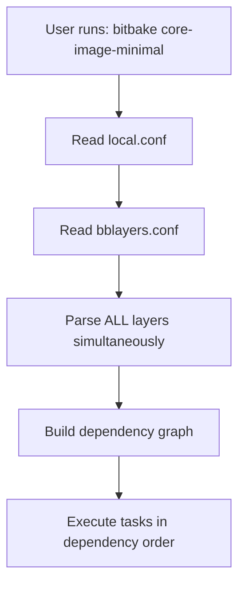

# How BitBake Builds: Understanding the Yocto Build Process

## Your Understanding - Let's Correct It

### ❌ What You Thought:
> "BSP, distro and software meta layers come under single meta layer"

**Reality**: No, they are **separate, independent layers**. There's no "master meta layer" containing them all.

---

### ❌ What You Thought:
> "BitBake first starts with BSP directory, then distro, then software"

**Reality**: BitBake **does NOT process layers sequentially**. It reads ALL layers simultaneously, then builds based on **task dependencies**, not layer order.

---

### ✅ What You Got Right:
- Packages/recipes are in software layers (though they can be in any layer)
- Base image and features are defined in distro layer
- Machine-specific info (architecture, bootloader, etc.) is in BSP layer

---

## How BitBake Actually Works

### Phase 1: Initialization and Configuration



#### Step 1: Environment Setup
```bash
# When you do this:
source oe-init-build-env

# It sets up:
# - BUILDDIR (usually ./build/)
# - PATH to include bitbake executable
# - Environment variables for the build
```

#### Step 2: User Triggers Build
```bash
bitbake core-image-minimal
```

BitBake reads configuration in this order:

1. **`conf/local.conf`** - Build settings (located in the Build Directory, not in a layer)
   ```bitbake
   MACHINE = "raspberrypi4"         # Which BSP to use
   DISTRO = "poky"                  # Which distro policies
   PACKAGE_CLASSES = "package_deb"  # Package format
   ```

2. **`conf/bblayers.conf`** - Which layers to use
   ```bitbake
   BBLAYERS = " \
       /path/to/poky/meta \              # OE-Core
       /path/to/meta-openembedded/meta-oe \
       /path/to/meta-raspberrypi \       # BSP layer
       /path/to/meta-mydistro \          # Distro layer
       /path/to/meta-myapps \            # Software layer
   "
   ```

---

### Phase 2: Layer Parsing (ALL AT ONCE!)

> [!IMPORTANT]
> **BitBake does NOT go "BSP → Distro → Software" sequentially!**

BitBake parses ALL layers **simultaneously** and collects:

```
┌─────────────────────────────────────────────────┐
│  BitBake Parser - Reading ALL Layers at Once   │
├─────────────────────────────────────────────────┤
│                                                 │
│  From meta-raspberrypi/ (BSP):                 │
│    ✓ raspberrypi4.conf (MACHINE config)        │
│    ✓ linux-raspberrypi_6.1.bb (kernel recipe)  │
│    ✓ bootfiles recipes                          │
│                                                 │
│  From meta-poky/ (Distro):                     │
│    ✓ poky.conf (DISTRO config)                 │
│    ✓ core-image-minimal.bb (image recipe)      │
│                                                 │
│  From meta-openembedded/:                      │
│    ✓ gstreamer recipes, python recipes, etc.   │
│                                                 │
│  From meta-myapps/ (Your software):            │
│    ✓ camera-app_1.0.bb (your app)              │
│                                                 │
└─────────────────────────────────────────────────┘
         ↓
   ALL LAYERS PARSED INTO SINGLE METADATA DATABASE
```

#### What Gets Collected:

1. **Machine Configuration** (from BSP layer's `conf/machine/raspberrypi4.conf`):
   ```bitbake
   TARGET_ARCH = "arm"
   PREFERRED_PROVIDER_virtual/kernel = "linux-raspberrypi"
   KERNEL_IMAGETYPE = "Image"
   ```

2. **Distro Configuration** (from distro layer's `conf/distro/poky.conf`):
   ```bitbake
   INIT_MANAGER = "systemd"
   DISTRO_FEATURES = "systemd wifi bluetooth"
   ```

3. **ALL Recipe Files** (`.bb` and `.bbappend` from all layers):
   - `linux-raspberrypi_6.1.bb` (kernel)
   - `gstreamer1.0_1.22.bb` (multimedia)
   - `camera-app_1.0.bb` (your app)
   - `core-image-minimal.bb` (image definition)

4. **Layer Priorities** (from each layer's `conf/layer.conf`):
   ```bitbake
   BBFILE_PRIORITY_raspberrypi = "9"  # Higher = wins conflicts
   BBFILE_PRIORITY_myapps = "6"
   ```

---

### Phase 3: Recipe Resolution and Dependency Graph

BitBake doesn't compile "BSP first, then distro, then software". Instead:

1. **Target Recipe**: You asked for `core-image-minimal`
2. **Dependency Analysis**: BitBake reads the recipe and finds dependencies

```bitbake
# core-image-minimal.bb (from meta/recipes-core/images/)
inherit core-image

IMAGE_INSTALL = "packagegroup-core-boot ${CORE_IMAGE_EXTRA_INSTALL}"

# This image needs:
# - base-files
# - busybox
# - systemd (if INIT_MANAGER = "systemd")
# - kernel (PREFERRED_PROVIDER_virtual/kernel)
# - bootloader
# - ALL packages in IMAGE_INSTALL
```

3. **Recursive Dependency Resolution**:

```
core-image-minimal
├── packagegroup-core-boot
│   ├── base-files
│   ├── busybox
│   └── systemd
│       ├── util-linux
│       └── libcap
├── virtual/kernel (resolves to linux-raspberrypi)
│   ├── bc (build dependency)
│   ├── bison (build dependency)
│   └── Device tree compiler
└── virtual/bootloader (resolves to rpi-firmware)
    └── gpu-firmware
```

BitBake builds a **Directed Acyclic Graph (DAG)** of ALL dependencies.

---

### Phase 4: Task Execution (Dependency Order, NOT Layer Order!)

Each recipe has **tasks**:

```bitbake
do_fetch      # Download source code
do_unpack     # Extract archives
do_patch      # Apply patches
do_configure  # Run ./configure or equivalent
do_compile    # Build the software
do_install    # Install to staging area
do_package    # Create packages (.deb, .rpm, .ipk)
do_rootfs     # Assemble root filesystem (images only)
```

#### Build Order Example:

```
Step 1: Fetch all source code (parallel where possible)
  ├─ do_fetch: linux-raspberrypi (kernel)
  ├─ do_fetch: gstreamer1.0
  ├─ do_fetch: camera-app
  └─ do_fetch: systemd

Step 2: Build dependencies first (bottom-up)
  ├─ Build: util-linux (systemd needs it)
  ├─ Build: libcap (systemd needs it)
  ├─ Build: systemd
  └─ Build: gstreamer1.0

Step 3: Build kernel (BSP)
  └─ Build: linux-raspberrypi

Step 4: Build your applications
  └─ Build: camera-app (depends on gstreamer)

Step 5: Package everything
  └─ Create .deb packages for all

Step 6: Create root filesystem
  └─ do_rootfs: core-image-minimal
      ├─ Install all packages from IMAGE_INSTALL
      ├─ Run post-install scripts
      └─ Generate filesystem image

Step 7: Create bootable image
  └─ Combine: bootloader + kernel + rootfs → .sdimg
```

> [!IMPORTANT]
> **BitBake builds in DEPENDENCY order, not layer order!**
> 
> If `camera-app` depends on `gstreamer`, BitBake builds `gstreamer` first, regardless of which layer each is in.

---

## Where Does BitBake "Sit"?

```
yocto-project/
├── poky/
│   ├── bitbake/              # ← BitBake executable lives here
│   │   ├── bin/bitbake       # The actual Python script
│   │   └── lib/              # BitBake Python libraries
│   └── meta/                 # OE-Core layer
├── meta-openembedded/
├── meta-raspberrypi/         # BSP layer
├── meta-mydistro/            # Distro layer
├── meta-myapps/              # Software layer
└── build/
    ├── conf/
    │   ├── local.conf        # ← BitBake reads this first
    │   └── bblayers.conf     # ← Then this
    ├── tmp/                  # ← BitBake writes output here
    │   ├── deploy/           # Final images and packages
    │   ├── work/             # Build directories for each recipe
    │   └── sysroots/         # Cross-compilation environment
    └── cache/                # Parsed metadata cache
```

### When you run `bitbake`:

1. **Python interpreter** executes `/path/to/poky/bitbake/bin/bitbake`
2. BitBake **reads `conf/local.conf`** for build settings
3. BitBake **reads `conf/bblayers.conf`** for layer locations
4. BitBake **parses ALL layers** into a metadata database
5. BitBake **analyzes dependencies** for the target recipe
6. BitBake **executes tasks** in dependency order

---

## Example: Building for Raspberry Pi

```bash
# In conf/local.conf
MACHINE = "raspberrypi4"
DISTRO = "poky"

# When you run:
bitbake core-image-minimal
```

### What Happens:

#### 1. Configuration Resolution
```
MACHINE = "raspberrypi4" 
  → BitBake loads: meta-raspberrypi/conf/machine/raspberrypi4.conf
  → Sets: TARGET_ARCH = "arm"
  → Sets: PREFERRED_PROVIDER_virtual/kernel = "linux-raspberrypi"

DISTRO = "poky"
  → BitBake loads: meta/conf/distro/poky.conf
  → Sets: INIT_MANAGER = "systemd"
  → Sets: DISTRO_FEATURES = "systemd wifi bluetooth"
```

#### 2. Recipe Selection
```
Target: core-image-minimal

From IMAGE_INSTALL:
  ✓ packagegroup-core-boot
  ✓ kernel-modules (from linux-raspberrypi)
  ✓ systemd
  ✓ base-files
  ✓ busybox
```

#### 3. Dependency Resolution
```
core-image-minimal requires:
  → linux-raspberrypi (kernel)
      → Needs: gcc-cross, binutils-cross, bc, bison
  → systemd (init system)
      → Needs: util-linux, libcap, glib-2.0
  → base-files
  → bootloader firmware
```

#### 4. Build Execution (Simplified)
```
[1/150] Building gcc-cross-aarch64
[2/150] Building binutils-cross-aarch64
[50/150] Building glib-2.0
[51/150] Building util-linux
[52/150] Building systemd
[100/150] Building linux-raspberrypi (KERNEL)
[120/150] Building rpi-bootfiles (BSP firmware)
[140/150] Packaging all recipes
[150/150] Creating core-image-minimal rootfs
```

---

## Layer Priority and Overrides

Layers don't build in sequence, but **priority matters for conflicts**:

```bitbake
# Scenario: Two layers provide openssh recipe

# meta-openembedded/meta-oe/recipes-connectivity/openssh/openssh_9.0.bb
# meta-myapps/recipes-connectivity/openssh/openssh_9.0.bb

# Which one wins?

# meta-openembedded/meta-oe/conf/layer.conf
BBFILE_PRIORITY_openembedded = "5"

# meta-myapps/conf/layer.conf
BBFILE_PRIORITY_myapps = "7"

# Result: meta-myapps wins! (higher priority)
```

### Using `.bbappend` (Better Approach)
```bitbake
# Instead of copying entire recipe, use .bbappend:

# meta-myapps/recipes-connectivity/openssh/openssh_%.bbappend
FILESEXTRAPATHS:prepend := "${THISDIR}/files:"
SRC_URI += "file://custom-sshd-config"
```

BitBake **merges** the original recipe with the append file.

---

## What Compiles First?

**Answer**: Whatever has no dependencies (leaf nodes in the dependency graph).

Example build order:

```
1. Base toolchain (gcc-cross, binutils-cross) - No dependencies
2. Core libraries (glibc, zlib, libffi)       - Depend on toolchain
3. Utility libraries (glib-2.0, libxml2)      - Depend on core libs
4. System components (systemd, dbus)          - Depend on utilities
5. Kernel (linux-raspberrypi)                 - Depends on toolchain
6. Applications (gstreamer, your apps)        - Depend on libraries
7. Image assembly (core-image-minimal)        - Depends on EVERYTHING
```

> [!TIP]
> **Parallelization**: BitBake builds multiple independent recipes simultaneously (controlled by `BB_NUMBER_THREADS` in `local.conf`).

---

## Correcting Your Mental Model

### ❌ Old (Wrong) Mental Model:
```
BitBake starts
  → Reads BSP layer → Compiles BSP stuff
  → Reads Distro layer → Compiles distro stuff
  → Reads Software layer → Compiles apps
  → Done
```

### ✅ New (Correct) Mental Model:
```
BitBake starts
  → Reads ALL layers simultaneously
  → Builds metadata database (recipes, configs, variables)
  → Resolves what needs to be built (based on target)
  → Creates dependency graph (who needs what)
  → Executes tasks in dependency order
      ├─ Builds native tools first
      ├─ Builds libraries (dependencies)
      ├─ Builds applications
      ├─ Builds kernel and bootloader
      └─ Assembles final image
```

---

## Key Concepts Summary

| Concept | Reality |
|:--------|:--------|
| **Layer Processing** | All layers parsed simultaneously, not sequentially |
| **Build Order** | Based on recipe dependencies, NOT layer order |
| **Layer Priority** | Only matters for conflicts (same recipe in multiple layers) |
| **BSP Role** | Defines machine config; recipes can be built anytime based on dependencies |
| **Distro Role** | Defines policies and image contents; doesn't control build order |
| **Software Role** | Contains application recipes; built after their dependencies |
| **Parallelization** | BitBake builds independent recipes in parallel |

---

## Visualization: Actual BitBake Flow

```
USER: bitbake core-image-minimal
         ↓
    ┌────────────────┐
    │ Parse Configs  │
    │ - local.conf   │
    │ - bblayers.conf│
    └────────┬───────┘
             ↓
    ┌────────────────────────────┐
    │ Parse ALL Layers (Parallel)│
    │ • meta (OE-Core)           │
    │ • meta-raspberrypi (BSP)   │
    │ • meta-poky (Distro)       │
    │ • meta-openembedded        │
    │ • meta-myapps              │
    └────────┬───────────────────┘
             ↓
    ┌────────────────────────┐
    │ Build Metadata DB      │
    │ • All .bb files        │
    │ • All .bbappend files  │
    │ • All .conf files      │
    │ • Variable expansion   │
    └────────┬───────────────┘
             ↓
    ┌────────────────────────┐
    │ Resolve Dependencies   │
    │ for core-image-minimal │
    └────────┬───────────────┘
             ↓
    ┌────────────────────────┐
    │ Create Task DAG        │
    │ (Directed Acyclic Graph)│
    └────────┬───────────────┘
             ↓
    ┌────────────────────────┐
    │ Execute Tasks          │
    │ (Dependency Order)     │
    │ - Fetch sources        │
    │ - Build toolchain      │
    │ - Build libraries      │
    │ - Build kernel         │
    │ - Build apps           │
    │ - Create packages      │
    │ - Assemble image       │
    └────────┬───────────────┘
             ↓
    ┌────────────────────────┐
    │ Output in tmp/deploy/  │
    │ • .wic or .img file    │
    │ • .deb packages        │
    └────────────────────────┘
```

---

## Debugging: See What BitBake Is Doing

```bash
# Show task execution order
bitbake -g core-image-minimal
# Creates: task-depends.dot (dependency graph)

# Show what will be built
bitbake -n core-image-minimal

# Verbose mode (see detailed parsing)
bitbake -v core-image-minimal

# Show why a recipe is being built
bitbake -g core-image-minimal && cat task-depends.dot | grep linux-raspberrypi

# See final variable values for a recipe
bitbake -e linux-raspberrypi | grep ^KERNEL_IMAGETYPE=
```

---

## Common Misconceptions Clarified

### Misconception 1: "Layers build in order"
**Reality**: All layers are parsed together. Build order is by dependency graph.

### Misconception 2: "BSP compiles first"
**Reality**: BSP recipes (kernel, bootloader) compile when their dependencies are ready, often late in the build.

### Misconception 3: "Layer order in bblayers.conf matters for build"
**Reality**: Order only affects parsing priority for conflicts. Build order is dependency-based.

### Misconception 4: "Each layer is a separate build"
**Reality**: All layers merge into one unified metadata database.

---

## Further Reading

- [BitBake User Manual](https://docs.yoctoproject.org/bitbake/)
- [Yocto Project Overview Manual](https://docs.yoctoproject.org/overview-manual/)
- [Task Execution and Dependencies](https://docs.yoctoproject.org/ref-manual/tasks.html)
