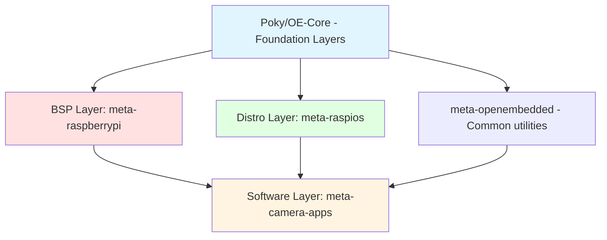

# Yocto Layer Architecture Deep Dive: Raspberry Pi Example

## Overview

Understanding Yocto layers is crucial for BSP development. While all layers follow the **meta-** naming convention and are technically "meta layers," they serve **fundamentally different purposes**. This guide uses **Raspberry Pi** as a practical example to clarify the architecture.

---

## Why Separate Layers?

The separation of layers follows the **Separation of Concerns** principle:

| Aspect | Benefit |
|:-------|:--------|
| **Maintainability** | Changes to hardware don't affect application code |
| **Reusability** | Same software layer can work across different hardware |
| **Collaboration** | Teams can work independently on BSP, distro, and apps |
| **Version Control** | Each layer has its own Git repository and release cycle |
| **Flexibility** | Mix and match layers from different vendors |

> [!IMPORTANT]
> Think of layers as **stackable lego blocks**. Each layer adds specific functionality without breaking the layers below.

---

## The Three Layer Types: A Raspberry Pi Breakdown

### 1. BSP Layer (Hardware Layer)

**Purpose**: Make the hardware boot and expose all hardware capabilities to the software.

**Raspberry Pi Example**: `meta-raspberrypi`

#### What It Contains:

```
meta-raspberrypi/
├── conf/
│   ├── layer.conf                    # Layer configuration
│   └── machine/
│       ├── raspberrypi4.conf         # RPi 4 specific settings
│       ├── raspberrypi3.conf         # RPi 3 specific settings
│       └── raspberrypi-cm4.conf      # Compute Module 4
├── recipes-bsp/
│   ├── bootfiles/                    # GPU firmware, boot config
│   └── u-boot/                       # Bootloader (if used)
├── recipes-kernel/
│   └── linux/
│       ├── linux-raspberrypi_*.bb    # Kernel recipe
│       ├── files/
│       │   └── defconfig             # Kernel configuration
│       └── *.dtb                     # Device tree binaries
├── recipes-graphics/
│   └── mesa/                         # GPU drivers (VideoCore)
└── recipes-connectivity/
    └── bluez5/                       # Bluetooth firmware
```

#### What BSP Layer Does:

1. **Machine Configuration** (`raspberrypi4.conf`):
```bitbake
# CPU Architecture
DEFAULTTUNE = "cortexa72"
require conf/machine/include/arm/armv8a/tune-cortexa72.conf

# Kernel
PREFERRED_PROVIDER_virtual/kernel = "linux-raspberrypi"
KERNEL_IMAGETYPE = "Image"
KERNEL_DEVICETREE = "broadcom/bcm2711-rpi-4-b.dtb"

# Bootloader
RPI_USE_U_BOOT = "0"  # RPi uses its own boot system

# Hardware Features
MACHINE_FEATURES = "apm usbgadget usbhost vfat alsa bluetooth wifi"
GPU_MEM = "256"  # RAM allocated to GPU

# Image Format
IMAGE_FSTYPES = "rpi-sdimg"
```

2. **Kernel Customization**:
   - Raspberry Pi-specific kernel patches
   - Device tree for GPIO, I2C, SPI, camera interface
   - Drivers for Broadcom VideoCore GPU

3. **Boot Process**:
   - `bootfiles` package: Contains `bootcode.bin`, `start.elf`, `config.txt`
   - GPU firmware initialization
   - Kernel loading mechanism

#### Key Characteristics:

- **Hardware-Specific**: Only works with Raspberry Pi hardware
- **Mostly Constant**: Changes only when new Pi models are released or critical bugs are fixed
- **Low-Level**: Deals with bootloaders, kernels, device trees, firmware

---

### 2. Distro Layer (Distribution Policy Layer)

**Purpose**: Define system-wide policies, default packages, and the "personality" of your Linux distribution.

**Raspberry Pi Example**: `meta-raspios` (hypothetical - Raspberry Pi OS policies)

#### What It Contains:

```
meta-raspios/
├── conf/
│   ├── layer.conf
│   └── distro/
│       └── raspios.conf              # Distro configuration
├── recipes-core/
│   ├── images/
│   │   ├── raspios-minimal.bb        # Minimal image
│   │   ├── raspios-desktop.bb        # Desktop image
│   │   └── raspios-full.bb           # Full-featured image
│   └── packagegroups/
│       └── packagegroup-raspios-base.bb
└── recipes-extended/
    └── branding/
        └── raspios-defaults/         # Desktop wallpapers, themes
```

#### What Distro Layer Does:

1. **Distro Configuration** (`raspios.conf`):
```bitbake
# Distribution Identity
DISTRO = "raspios"
DISTRO_NAME = "Raspberry Pi OS"
DISTRO_VERSION = "12.0"
DISTRO_CODENAME = "bookworm"

# Init System
INIT_MANAGER = "systemd"

# Toolchain & Library Versions
TCLIBC = "glibc"  # Or 'musl' for smaller systems
PREFERRED_VERSION_glibc = "2.38"

# Default Package Manager
PACKAGE_CLASSES = "package_deb"  # RPi OS uses .deb packages

# Security Policies
DISTRO_FEATURES = "systemd pam wayland wifi bluetooth"
DISTRO_FEATURES_BACKFILL_CONSIDERED = "sysvinit"

# Optimization Flags
FULL_OPTIMIZATION = "-O2 -pipe -fomit-frame-pointer"

# Default User & Hostname
DEFAULT_HOSTNAME = "raspberrypi"
DEFAULT_USER = "pi"
```

2. **Image Definitions**:
```bitbake
# raspios-minimal.bb
require recipes-core/images/core-image-minimal.bb

SUMMARY = "Minimal Raspberry Pi OS Image"

IMAGE_INSTALL += " \
    openssh \
    raspi-config \
    rpi-gpio-utils \
    wireless-regdb \
"

# Enable serial console
ENABLE_UART = "1"
```

3. **System Policies**:
   - Package format (DEB vs RPM vs IPK)
   - Default networking setup
   - Security features (SELinux, AppArmor)
   - System optimization (size vs performance)

#### Key Characteristics:

- **Hardware-Agnostic**: Same distro can work on RPi 3, 4, Zero, etc.
- **Moderate Changes**: Updated for policy changes, security updates, new features
- **High-Level**: Deals with system behavior, not hardware specifics

---

### 3. Software/Application Layer

**Purpose**: Add specific applications, libraries, and middleware for your use case.

**Raspberry Pi Examples**:
- `meta-camera-apps` (for IP camera)
- `meta-ros` (for robotics)
- `meta-iot` (for IoT applications)

#### What It Contains:

```
meta-camera-apps/
├── conf/
│   └── layer.conf
├── recipes-apps/
│   ├── camera-streamer/
│   │   ├── camera-streamer_1.0.bb    # RTSP streaming app
│   │   └── files/
│   │       ├── camera-streamer.c
│   │       └── camera-streamer.service
│   └── motion-detection/
│       └── motion-detect_2.0.bb      # AI-based motion detection
├── recipes-multimedia/
│   └── gstreamer1.0/
│       └── gstreamer1.0-plugins-%.bbappend  # Add custom plugins
└── recipes-connectivity/
    └── mqtt/
        └── mosquitto_%.bbappend      # MQTT broker config
```

#### What Software Layer Does:

1. **Custom Application Recipe**:
```bitbake
# camera-streamer_1.0.bb
SUMMARY = "RTSP Camera Streaming Application"
LICENSE = "MIT"
LIC_FILES_CHKSUM = "file://LICENSE;md5=..."

# Dependencies
DEPENDS = "gstreamer1.0 gstreamer1.0-plugins-base v4l-utils"
RDEPENDS:${PN} = "gstreamer1.0-plugins-good kernel-module-bcm2835-v4l2"

# Source
SRC_URI = "git://github.com/mycompany/camera-streamer.git;protocol=https \
           file://camera-streamer.service"
SRCREV = "${AUTOREV}"

S = "${WORKDIR}/git"

inherit cmake systemd

SYSTEMD_SERVICE:${PN} = "camera-streamer.service"

do_install:append() {
    install -d ${D}${systemd_unitdir}/system
    install -m 0644 ${WORKDIR}/camera-streamer.service ${D}${systemd_unitdir}/system/
}
```

2. **Extending Existing Packages** (`.bbappend`):
```bitbake
# gstreamer1.0-plugins-good_%.bbappend
FILESEXTRAPATHS:prepend := "${THISDIR}/files:"

# Enable RPi camera support
PACKAGECONFIG:append = " rpicamsrc"
```

#### Key Characteristics:

- **Application-Specific**: Unique to your product/use case
- **Frequent Changes**: Active development, bug fixes, feature additions
- **Business Logic**: Contains your proprietary code and algorithms

---

## Layer Dependency Hierarchy



### Dependency Rules:

1. **BSP layers** depend on OE-Core (for kernel/bootloader recipes)
2. **Distro layers** depend on OE-Core (for base images)
3. **Software layers** depend on BSP + Distro + utility layers
4. **Never**: BSP should NOT depend on software layers

---

## Constant vs Modified Layers

| Layer Type | Modification Frequency | Who Modifies | What Triggers Changes |
|:-----------|:----------------------|:-------------|:----------------------|
| **OE-Core/Poky** | Once per Yocto release (6-12 months) | Yocto Project community | New Yocto release (LTS recommended) |
| **BSP Layer** | Rarely (new hardware, critical bugs) | Hardware vendor / BSP team | New board revision, kernel CVE, new Pi model |
| **Distro Layer** | Quarterly (security, policy updates) | System architects | Security policy, compliance, optimization |
| **Software Layer** | Daily/Weekly (active development) | Application developers | Features, bugs, customer requirements |
| **Vendor Layers** (meta-openembedded) | Monthly (package updates) | Community maintainers | Upstream package releases |

### Layer Update Strategy: Constant vs Frequently Modified

#### Constant (Stable) Strategy
**Approach**: Use LTS Yocto releases, minimize BSP changes, infrequent updates.

**Advantages**:
- ✅ High stability and predictability
- ✅ Lower immediate maintenance burden
- ✅ Fewer testing cycles required
- ✅ Deterministic builds over long periods

**Disadvantages**:
- ❌ Outdated components (security risk)
- ❌ Accumulated "update debt" - major upgrades become extremely painful
- ❌ Missing latest features and bug fixes
- ❌ Yocto is NOT backward compatible - big jumps are very difficult

**When to Use**: Mature products in maintenance mode, regulated industries with long certification cycles.

---

#### Frequent Update Strategy
**Approach**: Regular updates to newer Yocto releases, track upstream changes, continuous integration.

**Advantages**:
- ✅ Latest security patches and bug fixes
- ✅ Smaller, manageable update increments
- ✅ Access to new features and hardware support
- ✅ Reduced long-term technical debt

**Disadvantages**:
- ❌ Higher maintenance overhead
- ❌ Frequent testing required (can take weeks)
- ❌ Breaking changes from Yocto, kernel, toolchain
- ❌ Potential temporary instabilities

**When to Use**: Active development, products requiring latest security, teams with CI/CD infrastructure.

> [!WARNING]
> **The Hidden Cost of "Constant"**: Yocto Project is **not backward compatible**. Delaying updates creates massive technical debt. A jump from Yocto 3.1 (Dunfell) to 4.3 (Nanbield) requires rewriting large portions of your layers due to:
> - Variable override syntax changes (`:` → `:`)
> - Kernel API incompatibilities
> - Device tree structure changes
> - Toolchain updates (GCC, glibc)
> - Library API changes (OpenSSL, systemd)
>
> **Recommendation**: Update at least once per year, preferably to LTS releases.

### Real-World Raspberry Pi Project Structure:

```bash
# Typical production Yocto project organization
yocto-project/
├── layers/
│   ├── third-party/           # External/community layers
│   │   ├── poky/              # CONSTANT (update once per Yocto release)
│   │   ├── meta-openembedded/ # CONSTANT (update monthly for packages)
│   │   └── meta-raspberrypi/  # CONSTANT (update when new RPi model)
│   └── project/               # Your custom layers
│       ├── meta-ipcam-bsp/    # MODIFIED RARELY (hardware changes)
│       ├── meta-ipcam-distro/ # MODIFIED QUARTERLY (policy/security)
│       └── meta-ipcam-apps/   # MODIFIED DAILY (active development)
└── build/
    ├── conf/
    │   ├── local.conf         # Machine and build settings
    │   └── bblayers.conf      # Layer configuration
    └── tmp/                   # Build outputs
```

> [!TIP]
> **Organization Best Practice**: Separate `third-party` and `project` directories. This makes it clear which layers you control versus external dependencies, and simplifies Git repository management.

---

## Practical Configuration: `bblayers.conf`

When building for Raspberry Pi 4 as an IP camera:

```bitbake
# conf/bblayers.conf
BBLAYERS ?= " \
  /home/user/yocto/poky/meta \                           # Core OE
  /home/user/yocto/poky/meta-poky \                      # Reference distro
  /home/user/yocto/poky/meta-yocto-bsp \                 # Generic x86 BSP
  /home/user/yocto/meta-openembedded/meta-oe \           # Extra packages
  /home/user/yocto/meta-openembedded/meta-multimedia \   # GStreamer plugins
  /home/user/yocto/meta-openembedded/meta-networking \   # Network tools
  /home/user/yocto/meta-raspberrypi \                    # BSP LAYER
  /home/user/yocto/meta-ipcam-distro \                   # DISTRO LAYER
  /home/user/yocto/meta-ipcam-apps \                     # SOFTWARE LAYER
"
```

---

## How BitBake Uses These Layers

### Variable Override Mechanism:

Layers have **priority** (defined in `layer.conf`):

```bitbake
# meta-raspberrypi/conf/layer.conf
BBFILE_PRIORITY_raspberrypi = "9"

# meta-ipcam-distro/conf/layer.conf
BBFILE_PRIORITY_ipcam-distro = "7"

# meta-ipcam-apps/conf/layer.conf
BBFILE_PRIORITY_ipcam-apps = "6"
```

**Higher priority = wins in conflicts.**

### Example Override Chain:

```bitbake
# 1. OE-Core defines:
PREFERRED_VERSION_gstreamer1.0 = "1.22.0"

# 2. Distro layer overrides:
PREFERRED_VERSION_gstreamer1.0 = "1.24.0"

# 3. Software layer might add:
PACKAGECONFIG:append:pn-gstreamer1.0 = " rpicamsrc"
```

**Result**: GStreamer 1.24.0 with RPi camera support.

---

## Common Pitfalls & Best Practices

### ❌ **Anti-Pattern**: Mixing Concerns

```bitbake
# BAD: Application recipe in BSP layer
meta-raspberrypi/recipes-apps/my-app/...  # ❌
```

### ✅ **Best Practice**: Clear Separation

```bitbake
# GOOD: Application in dedicated layer
meta-ipcam-apps/recipes-apps/my-app/...  # ✅
```

---

### ❌ **Anti-Pattern**: Hardware-Specific Code in Distro

```bitbake
# BAD: In distro.conf
IMAGE_INSTALL:append = " bcm2835-firmware"  # ❌ Hardware-specific
```

### ✅ **Best Practice**: Hardware in BSP, Policy in Distro

```bitbake
# GOOD: In raspberrypi4.conf (BSP layer)
MACHINE_EXTRA_RDEPENDS += "bcm2835-firmware"  # ✅

# GOOD: In distro.conf
IMAGE_INSTALL:append = " openssh systemd"  # ✅ Generic
```

---

## When to Create a New Layer?

| Scenario | Layer Type | Example |
|:---------|:-----------|:--------|
| Supporting new hardware | BSP | `meta-smartcam-board` |
| Creating a product family | Distro | `meta-smartcam-os` |
| Adding business applications | Software | `meta-smartcam-apps` |
| Vendor SDK integration | Vendor | `meta-hisilicon` |
| Proof-of-concept testing | Temporary | `meta-experiment` (delete after) |

---

## Raspberry Pi Layer Commands

### Finding Raspberry Pi Layers:
```bash
# Clone meta-raspberrypi
git clone https://github.com/agherzan/meta-raspberrypi.git

# Check available machines
ls meta-raspberrypi/conf/machine/
# Output: raspberrypi4.conf, raspberrypi3.conf, etc.
```

### Inspecting Layer Contents:
```bash
# List all recipes in meta-raspberrypi
bitbake-layers show-recipes -b meta-raspberrypi

# See layer dependencies
bitbake-layers show-layers
```

### Building for Raspberry Pi 4:
```bash
# conf/local.conf
MACHINE = "raspberrypi4"

# Build minimal image
bitbake core-image-minimal

# Or with your custom image
bitbake ipcam-image
```

---

## Summary: The Three-Layer Mental Model


### Visual Layer Comparison


### The Golden Rule:

> **Hardware changes should NOT require application rewrites.**
> **Application changes should NOT require BSP modifications.**

This is only achievable through proper layer separation.

---

## Real-World Examples from Open Source Projects

Based on web research, here are exemplary Yocto layer organizations from GitHub:

### 1. OpenBMC Project
- **Repository**: Multiple repos managed with Google's `repo` tool
- **Layer Structure**: Clear separation of BSP (hardware), distro (OpenBMC policies), and application layers
- **Best Practice**: Used as a reference for well-structured Yocto ecosystems
- **Key Learning**: Use manifest files to manage multiple Git repositories for complex projects

### 2. Meta-RaspberryPi (Community BSP)
- **Repository**: `agherzan/meta-raspberrypi` on GitHub
- **Structure Highlights**:
  - `conf/machine/` - Separate `.conf` for each Pi model
  - `recipes-bsp/bootfiles/` - GPU firmware, boot config
  - `recipes-kernel/linux/` - Pi-specific kernel with `.bbappend`
  - `recipes-connectivity/bluez5/` - Bluetooth firmware overlays
- **Key Learning**: BSP layers should use `.bbappend` to extend upstream recipes, not copy them

### 3. Industrial Projects Pattern
- **Typical Organization**:
  ```
  meta-company-bsp/      # Hardware abstraction
  meta-company-distro/   # Company-wide policies
  meta-product-apps/     # Product-specific software
  ```
- **Key Learning**: Reuse BSP and distro across product families, only change application layer

---

## Common Mistakes (From Community Experience)

Based on Stack Overflow, Reddit, and Yocto mailing lists:

### 1. ❌ Putting Everything in One Layer
```bash
# BAD: meta-my-project/
#   ├── recipes-bsp/         # Hardware stuff
#   ├── recipes-distro/      # Distro policies
#   ├── recipes-apps/        # Applications
#   └── conf/distro/         # + Machine configs!
```
**Problem**: Cannot reuse components, hard to update, messy dependencies.

**Solution**: Separate into `meta-my-bsp`, `meta-my-distro`, `meta-my-apps`.

---

### 2. ❌ Copying Entire Recipes Instead of Using `.bbappend`
```bash
# BAD: Copying entire openssh_8.0.bb from meta-oe to your layer
```
**Problem**: When upstream updates to openssh 8.1, your copy gets stale. Merge conflicts on every update.

**Solution**: Create `openssh_%.bbappend`:
```bitbake
FILESEXTRAPATHS:prepend := "${THISDIR}/files:"
SRC_URI += "file://custom-sshd-config"
```

---

### 3. ❌ Hardcoded Paths in `bblayers.conf`
```bitbake
# BAD: Absolute paths that break on other machines
BBLAYERS = "/home/john/yocto/meta-raspberrypi ..."
```
**Problem**: Team members can't build, CI/CD fails.

**Solution**: Use relative paths or `${TOPDIR}`:
```bitbake
BBLAYERS = "${TOPDIR}/../layers/meta-raspberrypi ..."
```

---

### 4. ❌ Ignoring Layer Priorities
```bitbake
# In layer.conf
BBFILE_PRIORITY_my-layer = "1"  # BAD: Too low!
```
**Problem**: Your recipes get overridden by lower-priority layers.

**Solution**: Understand priority numbers:
- OE-Core: Priority 5
- BSP layers: Priority 6-9
- Distro layers: Priority 7
- App layers: Priority 6

**Higher number = wins conflicts**

---

### 5. ❌ Not Testing Across Yocto Releases
**Problem**: Sticking to old Yocto versions for years, then attempting upgrade.

**Real Experience** (from Yocto Summit talks):
- Company stayed on Yocto 2.7 (Warrior) for 3 years
- Attempted jump to Yocto 4.0 (Kirkstone)
- Result: 6 months of work, many layers had to be completely rewritten

**Solution**: Update at least annually, test against upcoming releases early.

---

## Advanced: Layer Dependencies and LAYERDEPENDS

Your `layer.conf` can declare dependencies:

```bitbake
# meta-ipcam-apps/conf/layer.conf
LAYERDEPENDS_ipcam-apps = " \
    core \
    openembedded-layer \
    raspberrypi \
    ipcam-distro \
"

LAYERSERIES_COMPAT_ipcam-apps = "scarthgap" # Yocto 5.0
```

**Benefits**:
- BitBake warns if dependencies are missing
- Documents layer relationships
- `LAYERSERIES_COMPAT` ensures layer works with specific Yocto versions

---

## Layer Management Commands (Cheat Sheet)

```bash
# Create new layer
bitbake-layers create-layer ../meta-my-layer

# Add layer to build
bitbake-layers add-layer ../meta-my-layer

# List all layers and priorities
bitbake-layers show-layers

# Find which layer provides a recipe
bitbake-layers show-recipes -f gstreamer1.0

# Show overlayed recipes (multiple layers provide same recipe)
bitbake-layers show-overlayed

# Check layer dependencies
bitbake-layers show-layers -fl

# Validate layer compatibility
bitbake-layers layerindex-fetch meta-example
```

---

## Yocto Release Compatibility

When choosing Yocto versions for your layers:

| Yocto Version | Codename | Release Date | LTS? | Status |
|:--------------|:---------|:-------------|:-----|:-------|
| 5.1 | Styhead | Oct 2024 | No | Current |
| 5.0 | Scarthgap | Apr 2024 | **Yes** | **Recommended** |
| 4.3 | Nanbield | Oct 2023 | No | Active |
| 4.0 | Kirkstone | Apr 2022 | **Yes** | Stable (until Apr 2026) |
| 3.1 | Dunfell | Apr 2020 | **Yes** | Maintenance (EOL Apr 2024) |

**Recommendation for New Projects**: Use **Scarthgap (5.0 LTS)** - 4 years of support.

**For Raspberry Pi 5**: Requires at least **Kirkstone (4.0)** or newer.

---

## Further Reading

- [Yocto Reference Manual - Layer Documentation](https://docs.yoctoproject.org/ref-manual/structure.html#layers)
- [meta-raspberrypi GitHub](https://github.com/agherzan/meta-raspberrypi)
- [BSP Developer's Guide](https://docs.yoctoproject.org/bsp-guide/)
- [OpenEmbedded Layer Index](https://layers.openembedded.org/) - Search existing layers before creating new ones
- [Yocto Project Mega Manual](https://docs.yoctoproject.org/singleindex.html) - Complete reference
- [Embedded Linux Conference Talks](https://embeddedlinuxconference.com/) - Real-world case studies
